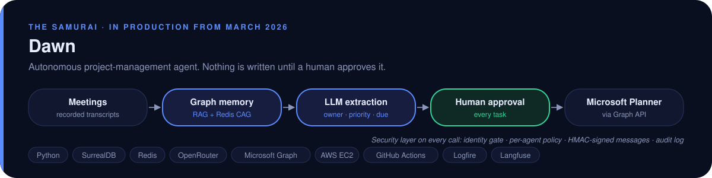
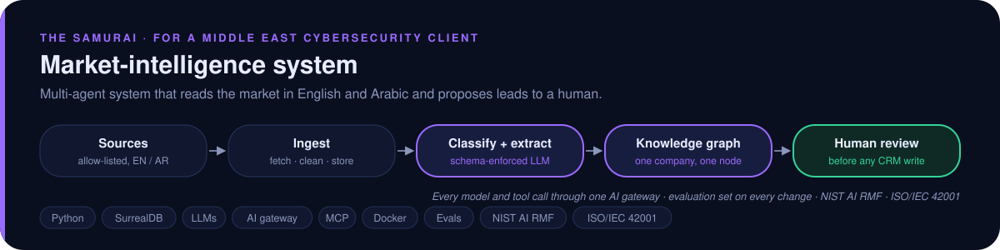
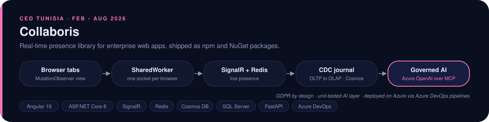
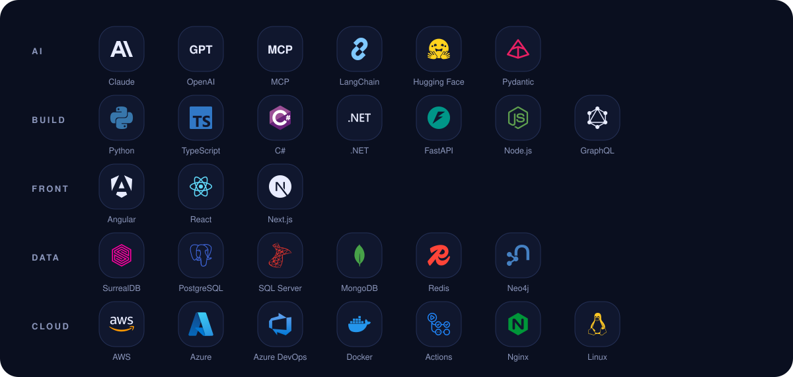

  

  
  
  
  

  I design and ship AI systems that run in production, with a human approving every step that matters 
  and the governance to prove it. <b>Software Architect &amp; AI Solution Integrator at The SamurAI.</b>

## What I build

These run inside private company repositories (GitHub and Azure DevOps). Full case studies and diagrams are on my <a href="https://saraheniaportfolio.vercel.app">portfolio</a>.

## Stack

## Activity

  
  

## Earlier projects

  
  
  
  

  Cisco CCNA · AWS Certified Cloud Practitioner · NVIDIA DLI · Arabic · English · French

